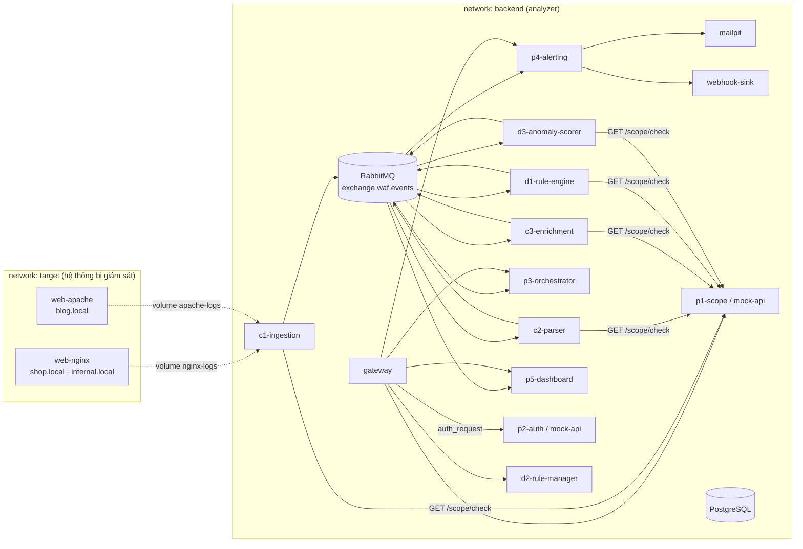

# Hạ tầng triển khai (Docker Compose)

Tài liệu này hướng dẫn chạy toàn bộ hạ tầng dùng chung của WAF Log Analyzer trên máy cá nhân và cắm từng service C1–C3, D1–D3, P1–P5 vào khi service đó sẵn sàng.

## Yêu cầu

- Docker Engine 24+ hoặc Docker Desktop, kèm **Docker Compose 2.30 trở lên** (cần tính năng `post_start`). Kiểm tra bằng `docker compose version`.
- `make`, `curl`, `jq`, `openssl`.
- Khoảng 2 GB RAM trống.

## Chạy nhanh

```bash
make up      # tạo .env (lần đầu), build & khởi động toàn hệ thống, chờ mọi container healthy
make demo    # gửi request bình thường + SQLi/XSS/path traversal tới web mục tiêu
make e2e     # nghiệm thu end-to-end toàn pipeline (theo "định nghĩa hoàn thành")
make smoke   # kiểm tra hạ tầng
make help    # xem tất cả lệnh
```

`.env` mặc định bật profile `mock,docs,app` (toàn bộ 11 service C1–P5) với Scope/Auth thật (P1/P2). Xem [`services/README.md`](../services/README.md) để chạy lẻ từng service theo profile.

Sau khi chạy `make up`:

| Địa chỉ | Dùng để |
|---|---|
| http://localhost:8081 | Web mục tiêu Nginx (`shop.local`) |
| http://localhost:8080 | API gateway (`/api/...`) và dashboard P5 (`/`) |
| http://localhost:15672 | RabbitMQ UI (tài khoản `RABBITMQ_USER` / `RABBITMQ_PASSWORD` trong `.env`) |
| http://localhost:8025 | Mailpit: xem email cảnh báo P4 gửi |
| http://localhost:8090 | Swagger UI: xem OpenAPI contract |

## Kiến trúc triển khai



- Web server mục tiêu nằm ở network riêng `target`. Nó chỉ chia sẻ file log với analyzer qua volume, giống như trường hợp chạy trên một máy khác.
- Service trong network `backend` gọi thẳng nhau bằng tên service (ví dụ `http://mock-api/scope/check`). Người dùng và công cụ bên ngoài đi qua `gateway`.
- Mọi cổng chỉ bind vào `127.0.0.1`.

## Thành phần

| Service | Image | Cổng host | Vai trò |
|---|---|---|---|
| `web-nginx` | nginx 1.28 | 8081 | Web mục tiêu, ghi access log cho `shop.local` và `internal.local` |
| `web-apache` | httpd 2.4 (build tại `infra/web-apache`) | 8082 | Web mục tiêu Apache cho `blog.local`, profile `apache` |
| `rabbitmq` | rabbitmq 4.1 + management | 5672, 15672 | Event bus |
| `postgres` | postgres 17 | 5432 | Lưu trữ; mỗi module một schema riêng |
| `gateway` | nginx 1.28 | 8080 | Định tuyến `/api/*`, xác thực JWT qua P2, rate limit |
| `mailpit` | mailpit | 8025 (UI), 1025 (SMTP) | Nhận email cảnh báo khi phát triển |
| `mock-api` | nginx 1.28 | 4010 | Mock P1 Scope + P2 Auth, profile `mock` |
| `webhook-sink` | http-https-echo | 4020 | Nhận webhook cảnh báo và in ra log, profile `mock` |
| `swagger-ui` | swagger-ui | 8090 | Xem `contracts/openapi`, profile `docs` |
| `c1-ingestion` … `p5-dashboard` | build từ `services/<tên>` | — | 11 service ứng dụng, mỗi service một profile (xem [services/README.md](../services/README.md)) |

Muốn đổi cổng thì sửa các biến `*_PORT` trong `.env`.

## Profile

Phần hạ tầng (`web-nginx`, `rabbitmq`, `postgres`, `gateway`, `mailpit`) luôn chạy. Các phần khác bật qua biến `COMPOSE_PROFILES` trong `.env`:

| Profile | Bật thêm |
|---|---|
| `mock` | `mock-api`, `webhook-sink` |
| `docs` | `swagger-ui` |
| `apache` | `web-apache` |
| `c1` … `p5` | Từng service ứng dụng |
| `collection` / `detection` / `platform` | Nhóm service của Người 1 / 2 / 3 |
| `app` | Cả 11 service ứng dụng |

Ví dụ: Người 1 đã có C1 và C2 nhưng P1, P2 vẫn đang dùng mock:

```bash
COMPOSE_PROFILES=mock,docs,c1,c2
```

Chỉ bật profile của service khi `services/<tên>/Dockerfile` đã tồn tại; nếu chưa có, bước build sẽ báo lỗi.

## Log của web server mục tiêu

Mỗi domain ghi ra một file riêng. C1 nên suy ra domain từ **tên file**, không dựa vào header `Host` vì client tự đặt được giá trị này.

| Đường dẫn (bên trong C1) | Domain | Scope theo mock |
|---|---|---|
| `/var/log/waf/nginx/shop.local.access.log` | `shop.local` | được phép |
| `/var/log/waf/nginx/internal.local.access.log` | `internal.local` | **bị từ chối**, dùng để kiểm thử việc bỏ qua log ngoài scope |
| `/var/log/waf/apache/blog.local.access.log` | `blog.local` | được phép (cần profile `apache`) |

Định dạng log là **combined** cộng thêm ba trường ở cuối, nên parser combined vẫn khớp phần đầu:

```text
# Nginx:  ... "$host" rt=<request_time, giây> sid="<cookie sessionid>"
172.23.0.1 - - [16/Sep/2026:09:11:06 +0000] "GET /api/products?id=1%27%20OR%20%271%27%3D%271 HTTP/1.1" 200 15 "-" "curl/8.7.1" "shop.local" rt=0.000 sid="demo-1"

# Apache: ... "%{Host}i" rt_us=<thời gian xử lý, micro giây> sid="%{sessionid}C"
172.23.0.1 - - [16/Sep/2026:09:20:40 +0000] "GET /api/products?id=1 HTTP/1.1" 404 236 "-" "Mozilla/5.0 ..." "blog.local" rt_us=863 sid="demo-1789550440"
```

Một số lưu ý cho parser:

- Trường rỗng được ghi là `-`.
- Nginx escape ký tự đặc biệt thành `\xHH`.
- Apache ghi `%b` là `-` khi phản hồi rỗng, Nginx ghi `0`.
- Giờ trong log theo UTC.

Một số lệnh hỗ trợ:

- `make tail-logs`: theo dõi log Nginx trực tiếp.
- `make rotate-logs`: đổi tên `*.access.log` thành `*.access.log.1` rồi `nginx -s reopen`. Dùng để kiểm thử C1 xử lý log rotation.
- `make demo`, `make demo-apache`: sinh traffic thử. Script chỉ gửi tới `127.0.0.1` hoặc `localhost`.

## Event bus

RabbitMQ dùng exchange topic `waf.events`, routing key trùng tên event. Mỗi consumer có một queue riêng `q.<tên-service>`. Consumer tự publish message lỗi sang `waf.events.dlx`, và các message này được gom vào `q.deadletter`. Chi tiết envelope, bảng event → queue và quy ước publish/consume: [contracts/events/README.md](../contracts/events/README.md).

Topology khai báo trong `infra/rabbitmq/definitions.json`:

- Được nạp bởi hook `post_start` (script `infra/rabbitmq/load-topology.sh`) mỗi khi container `rabbitmq` được tạo hoặc khởi động. Container chỉ báo healthy sau khi nạp xong.
- Nạp lại khi đang chạy: `make bus-topology`.
- Xoá message tồn đọng: `make bus-purge`.

Không nạp definitions lúc boot bằng cấu hình `definitions.local.path`, vì khi đó RabbitMQ bỏ qua việc tạo user mặc định từ `.env`.

Service chạy ngoài Docker (trên máy host) có thể kết nối tới `amqp://<user>:<pass>@localhost:5672/`.

## API gateway

| Route | Tới | Cần JWT |
|---|---|---|
| `POST /api/auth/token` | `AUTH_SERVICE_URL` → `/auth/token` | không (giới hạn 10 request/phút cho mỗi IP) |
| `/api/auth/*` (các endpoint khác) | `AUTH_SERVICE_URL` → `/auth/*` | có |
| `/api/scope/*` | `SCOPE_SERVICE_URL` → `/scope/*` | có |
| `/api/rules/*` | `RULES_SERVICE_URL` → `/rules/*` | có |
| `/api/pipelines/*` | `PIPELINE_SERVICE_URL` → `/pipelines/*` | có |
| `/api/alerts/*` | `ALERTING_SERVICE_URL` → `/alerts/*` | có |
| `/api/dashboard/*` | `DASHBOARD_SERVICE_URL` → `/dashboard/*` | có, hỗ trợ SSE/WebSocket |
| `/` | `DASHBOARD_SERVICE_URL` | không (giao diện P5) |
| `/dashboard`, `/dashboard/*` | — (trả 404) | chặn, để API của P5 chỉ đi qua `/api/dashboard/` |

Cách gateway xử lý một request:

1. Với route cần JWT, gateway gọi `GET /auth/verify` của P2 (`auth_request`). Token được lấy từ header `Authorization: Bearer <jwt>` hoặc cookie `waf_token`; `POST /auth/token` đặt sẵn cookie này (HttpOnly, SameSite=Strict) để dashboard dùng được `EventSource`/`WebSocket`. P2 trả 2xx kèm header `X-Auth-Subject` và `X-Auth-Roles`; gateway chuyển tiếp hai header này tới service đích và **ghi đè** mọi giá trị client tự gửi.
2. Gateway bỏ tiền tố `/api` trước khi chuyển tiếp.
3. Mọi request được gắn header `X-Request-ID`.

Lỗi do gateway sinh ra đều trả JSON:

- `401 unauthorized`: thiếu hoặc sai token.
- `429 rate_limited`: vượt giới hạn request.
- `502 upstream_unavailable`: service đích chưa chạy.

```bash
TOKEN=$(curl -s -X POST localhost:8080/api/auth/token \
  -H 'content-type: application/json' -d '{"client_id":"dev","client_secret":"dev"}' | jq -r .access_token)
curl -s -H "Authorization: Bearer $TOKEN" 'localhost:8080/api/scope/check?domain=shop.local'
```

## Chuyển từ mock sang service thật

`mock-api` trả lời theo `contracts/openapi/{scope,auth}.yaml`:

- `/scope/check` chỉ chấp nhận các domain/ứng dụng có trong `infra/mock-api/scope-allowlist.map`. Sau khi sửa file này, chạy `make mock-reload`.
- `/auth/token` trả về một token tĩnh.
- `/auth/verify` chấp nhận **mọi** token, dù gửi qua header hay cookie.

Khi P1 hoặc P2 bản thật đã sẵn sàng:

1. Thêm profile `p1` / `p2` vào `COMPOSE_PROFILES`.
2. Trong `.env`, đổi `SCOPE_SERVICE_URL=http://p1-scope:8000` và/hoặc `AUTH_SERVICE_URL=http://p2-auth:8000`.
3. Chạy `make up`. Gateway và các service được tạo lại với URL mới.
4. Chạy `make smoke`. Các kiểm tra gateway đều dựa trên contract nên phải pass với service thật. Nếu P2 thật yêu cầu thông tin đăng nhập hợp lệ, đặt `SMOKE_CLIENT_ID` và `SMOKE_CLIENT_SECRET` trước khi chạy.

## Database

PostgreSQL tạo sẵn các schema `scope`, `auth`, `pipeline`, `alerting`, `dashboard`, `rules`, `detection` (xem `infra/postgres/init/01-schemas.sql`). Mỗi module tự tạo bảng và tự quản lý migration trong schema của mình.

Script init chỉ chạy khi volume còn trống. Muốn chạy lại thì dùng `make clean`, lệnh này **xoá toàn bộ dữ liệu**.

## Dữ liệu và cấu hình dùng chung

| Thư mục host | Mount vào | Dùng cho |
|---|---|---|
| `config/rules/` | `/data/rules` (d1 chỉ đọc, d2 đọc–ghi) | File rule YAML/JSON |
| `config/pipelines/` | `/config/pipelines` (p3 chỉ đọc) | Cấu hình pipeline YAML |
| `data/geoip/` | `/data/geoip` (c3 chỉ đọc) | GeoIP DB. Tải bằng `make geoip` (DB-IP Lite, giấy phép CC BY 4.0: khi hiển thị vị trí cần ghi "IP Geolocation by DB-IP") |

Thư mục `data/` không được commit.

## Xử lý sự cố

| Hiện tượng | Cách xử lý |
|---|---|
| `make up` báo trùng cổng | Đổi biến `*_PORT` tương ứng trong `.env` |
| `post_start` không được hỗ trợ | Nâng cấp Docker Compose lên 2.30 trở lên |
| `rabbitmq` không healthy | Chạy `make logs s=rabbitmq` |
| `make bus-topology` báo `PRECONDITION_FAILED` | Đã đổi `arguments` của một queue đang tồn tại: xoá queue đó trên UI rồi chạy lại, hoặc `make clean` |
| Gateway trả `502 upstream_unavailable` | Service đích chưa chạy, hoặc biến `*_SERVICE_URL` sai |
| Gateway trả `429` ở `/api/auth/token` | Chờ khoảng 1 phút (giới hạn 10 request/phút) |
| Build lỗi `failed to read dockerfile` | Đã bật profile của một service chưa có `Dockerfile` |
| Sửa allowlist nhưng mock không đổi | Chạy `make mock-reload` |
| Muốn làm sạch hoàn toàn | `make clean` rồi `make up` |

## Lưu ý bảo mật

- `.env` chứa mật khẩu và không được commit. `make init` sinh mật khẩu ngẫu nhiên; `.env.example` chỉ chứa giá trị mẫu.
- Mọi cổng chỉ bind vào `127.0.0.1`. Không đổi sang `0.0.0.0` trên máy dùng chung mạng.
- `mock-api` chấp nhận mọi token và `mailpit` chấp nhận mọi thông tin đăng nhập SMTP. Hai thành phần này **chỉ dùng khi phát triển**.
- Service phía sau gateway chỉ nên tin `X-Auth-Subject` / `X-Auth-Roles` do gateway đặt, và từ chối request API không có hai header này. Network `backend` được coi là tin cậy trong môi trường dev.
- Web mục tiêu chỉ bỏ qua log của healthcheck nội bộ (lọc theo IP `127.0.0.1`), không lọc theo path. Nhờ vậy, request tấn công như `/healthz?<payload>` vẫn được ghi log.
- Access log chứa cookie `sessionid` để C3 gom phiên, nên không chia sẻ file log ra ngoài.
- Hệ thống chỉ phát hiện và cảnh báo. Hạ tầng không có thành phần nào chặn IP hay sửa cấu hình web server.
